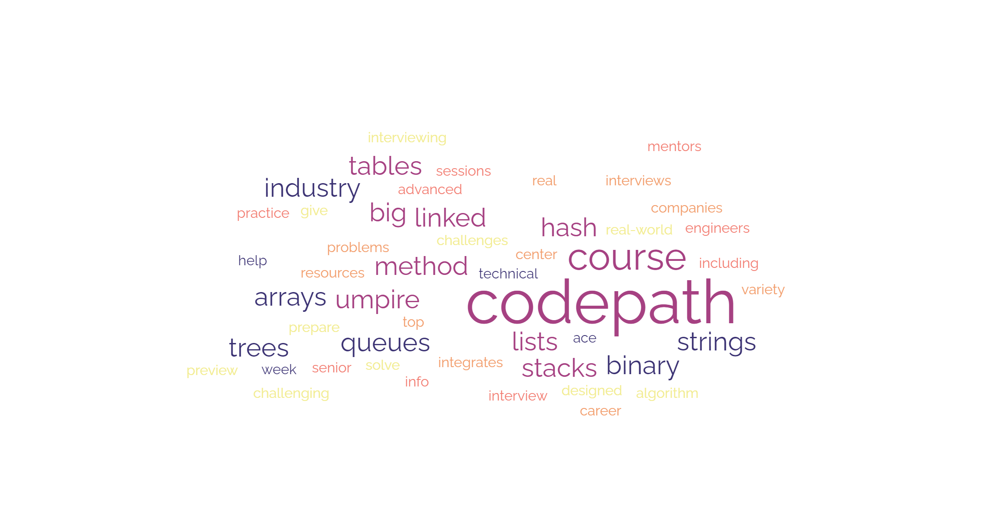

<!-- Heading -->
# Welcome to my notes on __Intermediate Software Engineering__ offered by CodePath.
I have been struggling to put my thoughts into words and I decided to challenge myself by taking these notes and publish them here for future reviews.

If you took, are taking or will take __Intermediate Software Engineering__ offered by CodePath and are going to brush up your head, please feel free to review my notes.

I would really appreciate your feedback, support and contribution on these notes. Feel free to reach out to me at: 

[LinkedIn](https://www.linkedin.com/in/mukhsadr, "LinkedIn")

[Gmail](mukhsadr@gmail.com, "mukhsadr@gmail.com")

[GitHub](https://github.com/mukhsadr, "GitHub")

---
## __Context__
---

* ### [Week 1: UMPIRE Method](Notes/Week%201%20Assignment%201%20and%202.md)
* ### [Week 2: Big O and Hash Tables](Notes/Week%202%20Assignment%201%20and%202.md)
* ### [Week 3: Linked Lists I](Notes/Week%203%20Assignment%201%20and%202.md)
